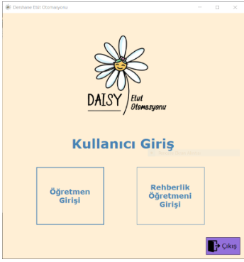
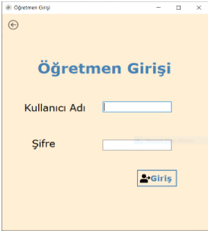
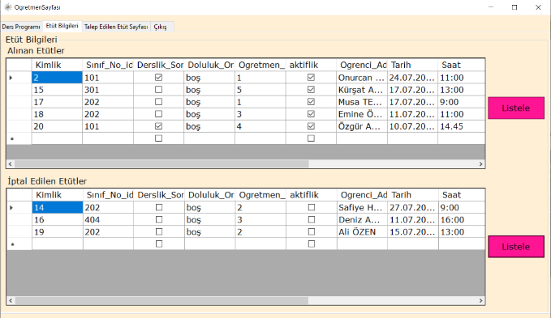
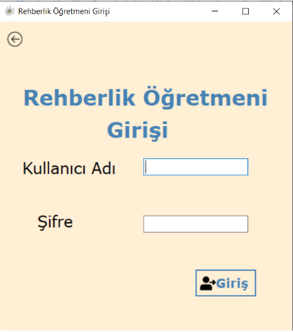
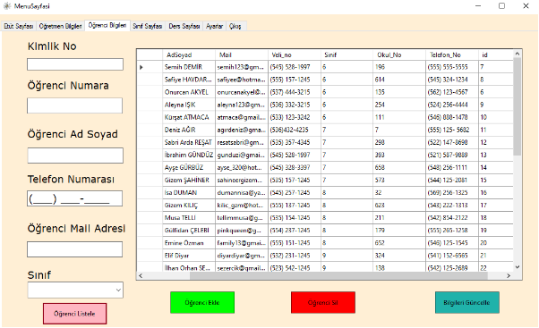
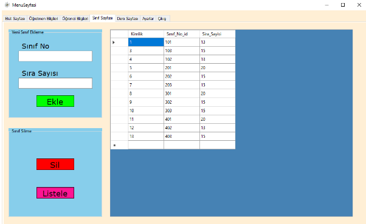
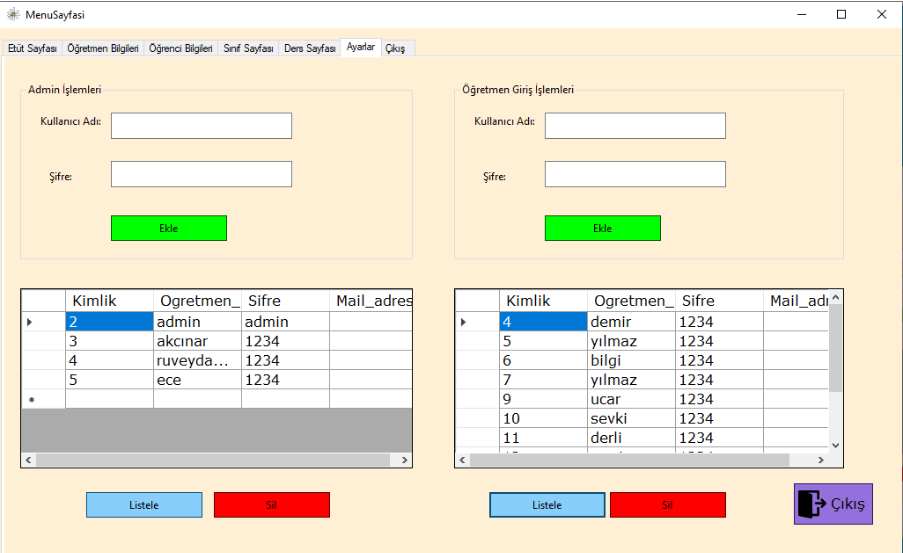

<h1>School Automation</h1>

With the rapid increase in the use of technology in every field recently, it has been determined as a result of the researches that educational institutions want to catch up with this technology. Thanks to the project my have developed, the psychological counselor will be able to automatically determine which teacher is vacant and write the study instead of manually writing it one by one for students who want to take studies. In this way, the margin of error is minimized and they will be able to process faster.

<h2>Login Screen</h2>

I have two entries in my project. For these two sections, there are separate screens for teacher entry and guidance counselor entry.

<h2>Teacher Login</h2>

In teacher login, the user can log in using the user name and password assigned to him. When he enters the wrong user name or password, he is faced with the warning "You have entered incorrectly".

<h2>Study Information</h2>

On this screen, teachers will be able to see the studies received on their behalf and all the studies that have been canceled.

<h2>Guidance Teacher Login</h2>

On the screen where the guidance teacher logs in, there is the entrance section of the same teacher login. When he enters the user name or password incorrectly, he encounters the warning "You have entered incorrectly".

<h2>Student Information</h2>

Guidance teacher will be able to register students on this screen. In addition, from this page, he will be able to delete a student leaving the school, update the information of the students and list all the students in the school.

<h2>Class Page</h2>

Guidance teacher will be able to open a new class registration and delete the existing class registration on this page. It will also be able to list all the classes available in the institution.

<h2>Settings Page</h2>

This page is the page that belongs to the guidance teacher we have specified as admin. Guidance teacher will be able to open a new registration for teachers from here and give a username and password. It will also be able to list and delete teachers. When a new guidance teacher comes to the school, he will be able to create an admin panel within him.

<h2>Result</h2>

As a result of the automation we have developed, the workload of the guidance teacher will be alleviated and the problems that will arise will be prevented. If we give an example of these problems; students may want to take more than one study from a teacher, while the guidance teacher writes it on a piece of paper because it is busy at that time or because the teacher has no vacancy. When the student comes to remind him again, that paper is lost. When these and similar events occur, the student can be in a difficult situation. In the project we have developed in order to prevent this, most educational institutions that follow technology and have a lot of student capacity will be able to integrate and use this application into their systems.

